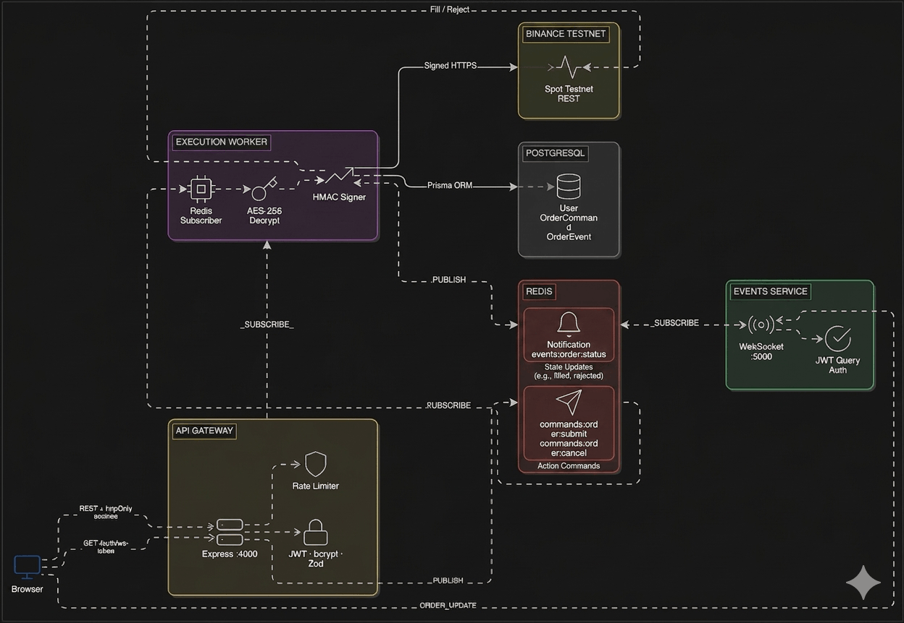
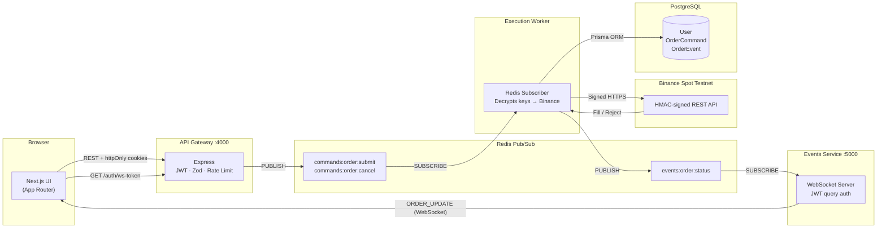
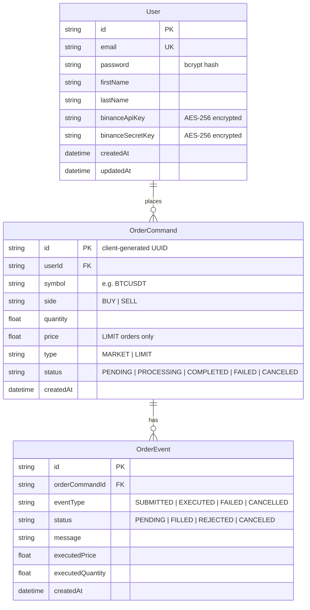
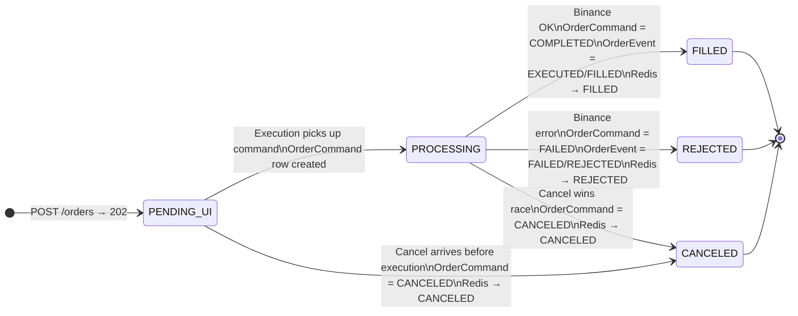
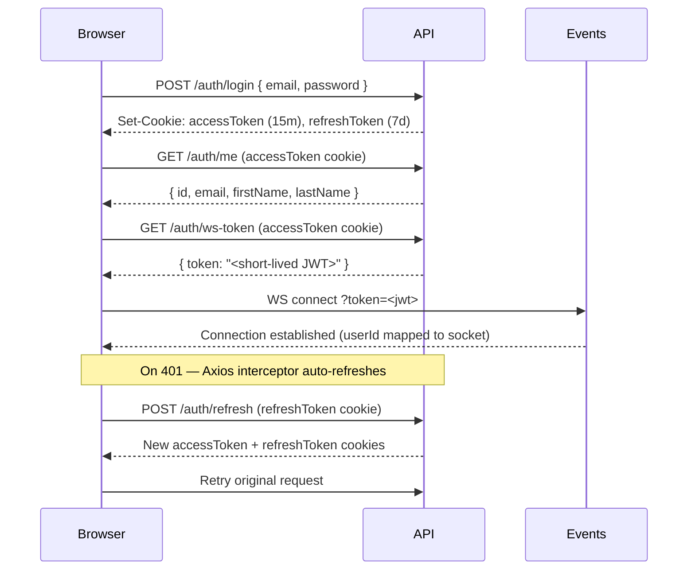

# TradeVault

> An event-driven trading engine built on a microservices architecture — a Next.js UI, an Express API gateway, a Redis pub/sub command bus, an isolated execution worker that signs requests to Binance Spot Testnet, and a WebSocket fan-out service for real-time order updates.

⚠️ **Testnet only.** No real funds are ever involved. Built for learning distributed systems and real-time infrastructure.

---

## Why I built this

I wanted to understand how the internals of a trading system actually work — not just the UI layer, but the full path from a button click to an exchange and back. That meant figuring out how to decouple order intake from execution, how to push real-time state changes without polling, how to store sensitive credentials safely, and how to structure a multi-service codebase that doesn't collapse into a monolith.

This project is the result of that. It's a realistic (if simplified) model of a distributed trading stack — with a deliberate separation between the API that accepts orders, the worker that executes them, and the service that fans updates back to the browser.

---

## Architecture

The core idea: **the API gateway never touches Binance directly.** It accepts an order, writes a command to Redis, and immediately returns `202 PENDING`. The execution worker picks up the command, decrypts the user's API keys, signs and fires the Binance REST request, writes the result to PostgreSQL, and publishes a status event. The events service picks that up and pushes it to the right WebSocket connection. The browser gets the update in real time — no polling.





### Why this architecture?

| Decision | Reason |
|----------|--------|
| API never calls Binance | Execution layer can scale, restart, or fail without affecting the REST interface |
| Redis pub/sub as command bus | Decouples services — API doesn't need to know execution is running |
| Separate events service | WebSocket connections live independently from HTTP request handling |
| Async `202` on order submit | UI is never blocked waiting for exchange confirmation |
| Per-user WebSocket routing | Only the user who placed the order receives its updates |

---

## Tech stack

| Service | Role | Stack |
|---------|------|-------|
| `apps/web` | Trading UI — auth, charts, order panel, positions | Next.js 14 (App Router), React 19, Tailwind CSS, Axios, lightweight-charts, TanStack Virtual |
| `apps/api` | REST API gateway, auth, Redis publisher | Express 4, Prisma 7 + `@prisma/adapter-pg`, `pg`, `ioredis`, JWT (httpOnly cookies), bcrypt, Zod, express-rate-limit, Vitest |
| `apps/execution` | Redis subscriber, Binance integration, DB writer | Node.js, `ioredis`, Prisma 7 + adapter, axios (HMAC-signed), AES-256-GCM decrypt |
| `apps/events` | Redis subscriber → WebSocket fan-out | Node.js, `ws`, `ioredis`, JWT (query string auth) |
| `packages/eslint-config` | Shared ESLint presets (flat config) | ESLint |
| `packages/typescript-config` | Shared `tsconfig` bases | TypeScript project references |
| Infrastructure | Containerisation, orchestration | Docker, Docker Compose, Turborepo, pnpm workspaces |

---

## Repository structure

```
.
├── apps/
│   ├── api/                    # Express API gateway
│   │   ├── src/
│   │   │   ├── index.ts        # Server entry point
│   │   │   ├── routes/         # auth.ts, trading.ts
│   │   │   ├── middleware/      # authenticate.ts, rateLimit.ts
│   │   │   ├── schemas/        # Zod validation schemas
│   │   │   └── utils/          # crypto.ts (AES encrypt), jwt.ts, cookies.ts
│   │   ├── prisma/schema.prisma
│   │   └── Dockerfile
│   │
│   ├── execution/              # Order execution worker
│   │   ├── src/
│   │   │   ├── index.ts        # Redis subscriber entry point
│   │   │   ├── binance.ts      # HMAC-signed Binance REST client
│   │   │   └── crypto.ts       # AES decrypt (matches api/utils/crypto.ts)
│   │   ├── prisma/schema.prisma
│   │   └── Dockerfile
│   │
│   ├── events/                 # WebSocket broadcaster
│   │   ├── src/
│   │   │   └── index.ts        # WS server + Redis subscriber
│   │   └── Dockerfile
│   │
│   └── web/                    # Next.js frontend
│       ├── app/
│       │   ├── layout.tsx
│       │   ├── page.tsx        # → /login redirect
│       │   ├── login/
│       │   ├── signup/
│       │   └── trade/[symbol]/ # Main trading terminal
│       ├── components/
│       │   ├── Header.tsx      # Symbol switcher, theme toggle, WS status
│       │   ├── OrderPanel.tsx  # Buy/sell form (market, limit)
│       │   ├── TradingChart.tsx # Candlesticks via Binance public REST
│       │   ├── TradingTabs.tsx
│       │   ├── OrdersTable.tsx # Live orders with cancel action
│       │   ├── PositionsTable.tsx
│       │   ├── PriceAlerts.tsx # localStorage-backed alerts
│       │   └── Toast.tsx
│       ├── hooks/
│       │   ├── useAuth.ts
│       │   ├── useWebSocket.ts # Auto-reconnect WS client
│       │   ├── usePriceAlerts.ts
│       │   └── useToast.ts
│       └── lib/
│           ├── api.ts          # Axios instance with 401 → refresh interceptor
│           ├── auth.ts
│           └── trading.ts
│
├── packages/
│   ├── eslint-config/          # base.js, next.js, react-internal.js
│   └── typescript-config/      # base.json, nextjs.json, react-library.json
│
├── docker-compose.yml          # Full local stack (postgres, redis, api, execution, events)
├── turbo.json                  # Turborepo pipeline
├── pnpm-workspace.yaml
└── package.json
```

---

## Getting started

### Prerequisites

- Node.js ≥ 18
- pnpm 9 (`npm install -g pnpm@9`)
- Docker + Docker Compose

### 1. Clone and install

```bash
git clone https://github.com/pavansohith/tradevault.git
cd tradevault
pnpm install
```

### 2. Set environment variables

Create `.env` files per service. See the [Environment variables](#environment-variables) table below for all required values.

Note: The `events` service requires `FRONTEND_URL` for WebSocket origin validation. The default `docker-compose.yml` does not inject it for the `events` container — add it manually or it will fail to start.

### 3. Run the database migration

```bash
cd apps/api
pnpm exec prisma db push   # or prisma migrate dev
cd ../..
```

### 4. Start with Docker Compose

```bash
docker compose up --build
```

| Port | Service |
|------|---------|
| `3000` | Next.js frontend |
| `4000` | API gateway |
| `5000` | Events (WebSocket + `/health`) |
| `5432` | PostgreSQL |
| `6379` | Redis |

### 5. Run the frontend locally

```bash
cd apps/web
pnpm dev
```

Set `NEXT_PUBLIC_API_URL` to <http://localhost:4000> and `NEXT_PUBLIC_WS_URL` to <ws://localhost:5000>.

### 6. Run services individually (no Docker)

```bash
# Terminal 1 — API
pnpm --filter api dev

# Terminal 2 — Execution worker
pnpm --filter execution dev

# Terminal 3 — Events
pnpm --filter events dev

# Terminal 4 — Frontend
pnpm --filter web dev
```

---

## Environment variables

### `apps/api`

| Variable | Required | Default | Description |
|----------|----------|---------|-------------|
| `PORT` | No | `4000` | HTTP listen port |
| `DATABASE_URL` | ✅ | — | PostgreSQL connection string |
| `REDIS_URL` | ✅ | — | Redis connection URL |
| `JWT_ACCESS_SECRET` | ✅ | — | Signs access JWTs (httpOnly cookies + WS tokens) |
| `JWT_REFRESH_SECRET` | ✅ | — | Signs refresh JWTs |
| `ENCRYPTION_SECRET` | ✅ | — | AES-256 key for encrypting Binance credentials at rest. **Must match `apps/execution`** |
| `FRONTEND_URL` | ✅ | — | Allowed CORS origin (e.g. `http://localhost:3000`) |
| `ACCESS_TOKEN_EXPIRY` | No | `15m` | Access token lifetime |
| `REFRESH_TOKEN_EXPIRY` | No | `7d` | Refresh token lifetime |
| `NODE_ENV` | No | `development` | Affects cookie `secure`/`sameSite` policy |

### `apps/execution`

| Variable | Required | Description |
|----------|----------|-------------|
| `DATABASE_URL` | ✅ | PostgreSQL connection string |
| `REDIS_URL` | ✅ | Redis connection URL |
| `ENCRYPTION_SECRET` | ✅ | Must match the API service value |
| `BINANCE_TESTNET_URL` | ✅ | Binance Spot Testnet base URL (e.g. `https://testnet.binance.vision`) |
| `BINANCE_BASE_URL` | No | Fallback if `BINANCE_TESTNET_URL` is unset |
| `NODE_ENV` | No | Runtime mode |

### `apps/events`

| Variable | Required | Description |
|----------|----------|-------------|
| `PORT` | No | HTTP/WS listen port (default `5000`) |
| `REDIS_URL` | ✅ | Redis connection URL |
| `JWT_ACCESS_SECRET` | ✅ | Verifies WS tokens issued by the API |
| `FRONTEND_URL` | ✅ | WebSocket origin check — **required, not in default Compose** |
| `NODE_ENV` | No | Runtime mode |

### `apps/web`

| Variable | Required | Description |
|----------|----------|-------------|
| `NEXT_PUBLIC_API_URL` | ✅ | API gateway URL visible in the browser |
| `NEXT_PUBLIC_WS_URL` | ✅ | Events WebSocket URL (e.g. `ws://localhost:5000`) |

---

## API reference

Base URL: <http://localhost:4000>

### Health

| Method | Path | Auth | Response |
|--------|------|------|----------|
| `GET` | `/health` | No | `{ status: "ok", service: "api-gateway" }` |

### Auth — `/auth` · Rate limit: 10 req/min

| Method | Path | Auth | Description |
|--------|------|------|-------------|
| `POST` | `/auth/register` | No | Creates user. Hashes password (bcrypt), encrypts Binance keys (AES-256). Sets `accessToken` + `refreshToken` httpOnly cookies. Returns `201 { id, email }`. |
| `POST` | `/auth/login` | No | Validates credentials. Sets cookies. |
| `POST` | `/auth/logout` | No | Clears both auth cookies. |
| `POST` | `/auth/refresh` | No (needs `refreshToken` cookie) | Verifies refresh JWT, re-issues both cookies (token rotation). |
| `GET` | `/auth/me` | ✅ | Returns current user profile (id, email, firstName, lastName). |
| `GET` | `/auth/ws-token` | ✅ | Returns a short-lived JWT (`1h`) for WebSocket authentication. |

### Trading — `/api/trading` · Rate limit: 30 req/min

| Method | Path | Auth | Description |
|--------|------|------|-------------|
| `POST` | `/api/trading/orders` | ✅ | Body: `{ symbol, side, type, quantity, price? }`. Publishes to `commands:order:submit`. Returns `202 { orderId, status: "PENDING" }` immediately. |
| `GET` | `/api/trading/orders` | ✅ | Lists user's orders. Status resolved from latest `OrderEvent` when present. |
| `GET` | `/api/trading/positions` | ✅ | Aggregates `FILLED` events by symbol to derive net positions. |
| `POST` | `/api/trading/cancel` | ✅ | Body: `{ orderId }`. Validates ownership + cancellable state. Publishes to `commands:order:cancel`. Rejects if order is already `FILLED`, `REJECTED`, or `CANCELED`. |

---

## Redis channels

Only pub/sub is used — no key-value cache layer.

| Channel | Publisher | Subscriber | Payload |
|---------|-----------|------------|---------|
| `commands:order:submit` | `apps/api` | `apps/execution` | `{ orderId, userId, symbol, side, type, quantity, price?, timestamp }` |
| `commands:order:cancel` | `apps/api` | `apps/execution` | `{ orderId, userId, timestamp }` |
| `events:order:status` | `apps/execution` | `apps/events` | `{ orderId, userId, status, symbol, side, quantity, price?, executedPrice?, executedQuantity?, error?, timestamp }` |

---

## Database schema

One logical schema, Prisma files duplicated per service. `User` → `OrderCommand` → `OrderEvent` (append-only event log).



---

## Order lifecycle



### Cancel guard (API layer)

If the latest `OrderEvent.status` is already `FILLED`, `REJECTED`, or `CANCELED`, the cancel request is rejected immediately — no Redis publish.

---

## Authentication flow



### Key points

- All auth state lives in **httpOnly cookies** — not localStorage, not JS-accessible
- Refresh tokens **rotate** on every use
- WebSocket auth uses a **dedicated short-lived JWT** passed as a query parameter, verified against the same `JWT_ACCESS_SECRET`
- Cookie `secure` and `sameSite` behaviour is tightened in production (`NODE_ENV=production`)

---

## Security design

| Concern | Implementation |
|---------|---------------|
| Binance API keys | AES-256-GCM encrypted before DB write (API). Decrypted in memory only inside the Execution worker. Never logged. |
| Auth tokens | httpOnly cookies, not accessible to JavaScript |
| Refresh token rotation | New pair issued on every `/auth/refresh` call |
| WebSocket auth | Dedicated JWT (`1h`), verified on connect, user ID bound to socket map |
| Rate limiting | Auth: 10 req/min. Trading: 30 req/min. Enforced at Express middleware layer |
| Input validation | All request bodies validated with Zod schemas before reaching handlers |
| CORS | Restricted to `FRONTEND_URL` origin only |

---

## Frontend

### Pages

| Route | Description |
|-------|-------------|
| `/` | Redirects to `/login` |
| `/login` | Email + password login |
| `/signup` | Registration — collects Binance Testnet API key + secret |
| `/trade` | Redirects to `/trade/BTCUSDT` |
| `/trade/[symbol]` | Main trading terminal |

### Components

| Component | Role |
|-----------|------|
| `Header` | Symbol switcher, dark/light theme toggle, WebSocket connection status indicator, user menu + logout |
| `OrderPanel` | Market and limit order form with buy/sell toggle |
| `TradingChart` | Candlestick chart powered by `lightweight-charts` — data from Binance **public** REST (note: mainnet candles, testnet execution — prices may diverge) |
| `OrdersTable` | Live order list with cancel button on pending rows |
| `PositionsTable` | Net positions derived from filled events |
| `PriceAlerts` | Client-side price alerts persisted in `localStorage` |
| `Toast` | Ephemeral notification system |

### Key hooks

| Hook | Role |
|------|------|
| `useAuth` | Session management, login/logout, `/auth/me` fetch |
| `useWebSocket` | Auto-reconnecting WS client, parses `ORDER_UPDATE` messages |
| `usePriceAlerts` | Compares live price against stored alerts, triggers toasts |
| `useToast` | Toast queue management |

### Axios refresh interceptor

On any `401`, `apps/web/lib/api.ts` automatically:

1. Posts to `/auth/refresh` once (with cookies)
2. Retries the original request
3. On second failure — redirects to `/login`

---

## Monorepo (Turborepo)

```json
// turbo.json pipeline summary
{
  "build":      { "dependsOn": ["^build"], "outputs": [".next/**", "dist/**"] },
  "dev":        { "cache": false, "persistent": true },
  "lint":       {},
  "check-types": {}
}
```

`pnpm-workspace.yaml` includes `apps/*` and `packages/*`. Shared packages (`eslint-config`, `typescript-config`) are consumed by all apps without being published.

---

## Docker

Each backend service has its own multi-stage Dockerfile:

```
Stage 1 (base)    → Node 20 Alpine, pnpm setup
Stage 2 (deps)    → Install all dependencies
Stage 3 (build)   → TypeScript compile, Prisma generate
Stage 4 (runner)  → Production image, node dist/index.js
```

`docker-compose.yml` wires all services with:

- Named volumes for PostgreSQL data persistence
- Healthchecks on `postgres` and `redis` before dependent services start
- Development bind-mounts for source hot-reload

---

## Known limitations

These are real issues found during development — documented honestly.

| Issue | Detail |
|-------|--------|
| `FRONTEND_URL` missing in Compose for `events` | Events container crashes on start without it. Add it to the `events` service env block. |
| Chart vs execution venue mismatch | `TradingChart` streams candles from Binance **mainnet** public endpoints. Orders execute on **testnet**. Prices will differ. |
| Cancel sends internal UUID to Binance | `cancelOrder` passes the internal UUID as the Binance `orderId`. Production systems should store and use the exchange-assigned order ID. |
| Optimistic UI for orders | The orders list shows `PENDING` immediately before the execution service creates the DB row. A refetch resolves the state. |
| `useAuth` no redirect on failed session | If `/trade` loads with an invalid session, `user` stays `null` with no automatic redirect to `/login`. |
| `STOP_MARKET` not implemented backend | `OrderPanel` accepts stop orders but maps them to `MARKET` client-side. Backend has no stop order support. |
| Events Prisma client unused | `apps/events/Dockerfile` generates a Prisma client but `src/index.ts` doesn't import it. |

---

## License

MIT © 2026 Ratakonda Venkata Pavan Sohith

Permission is hereby granted, free of charge, to any person obtaining a copy of this software and associated documentation files (the "Software"), to deal in the Software without restriction, including without limitation the rights to use, copy, modify, merge, publish, distribute, sublicense, and/or sell copies of the Software, and to permit persons to whom the Software is furnished to do so, subject to the following conditions:

The above copyright notice and this permission notice shall be included in all copies or substantial portions of the Software.

THE SOFTWARE IS PROVIDED "AS IS", WITHOUT WARRANTY OF ANY KIND, EXPRESS OR IMPLIED, INCLUDING BUT NOT LIMITED TO THE WARRANTIES OF MERCHANTABILITY, FITNESS FOR A PARTICULAR PURPOSE AND NONINFRINGEMENT. IN NO EVENT SHALL THE AUTHORS OR COPYRIGHT HOLDERS BE LIABLE FOR ANY CLAIM, DAMAGES OR OTHER LIABILITY, WHETHER IN AN ACTION OF CONTRACT, TORT OR OTHERWISE, ARISING FROM, OUT OF OR IN CONNECTION WITH THE SOFTWARE OR THE USE OR OTHER DEALINGS IN THE SOFTWARE.
